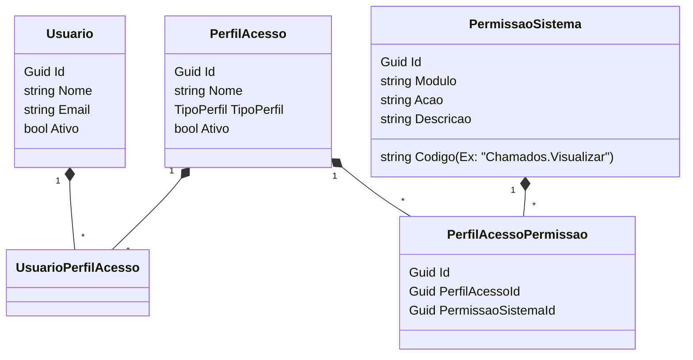

# SGX Sistema de Chamados — Autorização, Perfis, Permissões e Menus

Este documento fornece um panorama técnico e conceitual completo sobre o funcionamento da autorização de segurança no SGX Sistema de Chamados, catalogando todos os menus, páginas/rotas e ações do sistema, e mapeando-os para as permissões correspondentes.

---

## 1. Arquitetura de Autorização Atual

A segurança do SGX baseia-se em um modelo híbrido e desacoplado de Autenticação Corporativa e Autorização Interna:
- **Autenticação:** Realizada via Microsoft Entra ID (Azure AD), que garante a identidade e o login corporativo do usuário.
- **Autorização:** Controlada internamente pelo SGX por meio de **Perfis de Acesso** e **Permissões de Sistema**. O sistema não utiliza nem confia em grupos ou papéis do Azure AD para conceder direitos operacionais diretamente; todo o controle granular é feito internamente.

### Unificação em GET `/api/me`
No momento em que o usuário se autentica, a API unifica seus perfis e permissões vinculadas por meio do endpoint `/api/me`. A resposta unifica múltiplos perfis de acesso ativos e suas respectivas permissões em uma única lista limpa e sem duplicidades, servindo como a fonte da verdade para o frontend.

---

## 2. Como PerfilAcesso se Relaciona com PermissaoSistema

A estrutura do banco de dados mapeia essa relação por meio de uma tabela associativa clássica no padrão DDD:



---

## 3. Validação de Permissões no Backend

O ASP.NET Core 9 utiliza um sistema flexível de requisitos dinâmicos baseado em políticas protegidas por `[Authorize]`.

1. **Requirement & AuthorizationHandler:** O sistema possui uma classe `PermissionRequirement` que representa uma permissão exigida. O `PermissionAuthorizationHandler` estende `AuthorizationHandler<PermissionRequirement>`, lê as permissões efetivas do usuário autenticado (através de `UsuarioAtualService`) e verifica se ele possui a permissão requerida.
2. **Dynamic Policy Provider:** Para evitar o registro manual de dezenas de políticas individuais em `Program.cs`, o `PermissionPolicyProvider` resolve políticas dinamicamente caso comecem com o prefixo `Permissao:`. Por exemplo, declarar `[Authorize(Policy = "Permissao:Chamados.Assumir")]` resolve dinamicamente a política que exige a permissão `Chamados.Assumir`.

---

## 4. Como o Frontend Usa `permissoes.ts` e `authStore`

O frontend espelha rigorosamente os mesmos códigos literais do backend:

- **Constants (`permissoes.ts`):** Centraliza os códigos em um objeto imutável `permissoes` do TypeScript para evitar string literais espalhadas nas Views (Ex: `permissoes.chamadosAssumir` mapeia para `'Chamados.Assumir'`).
- **AuthStore Helpers:** A Pinia `useAuthStore` expõe métodos reativos cruciais para controle visual:
  - `possuiPermissao(codigo: string): boolean`
  - `possuiAlgumaPermissao(codigos: string[]): boolean`
  - `possuiTodasPermissoes(codigos: string[]): boolean`

---

## 5. Como o Menu e as Rotas Usam `requiredAnyPermissions`

### Nas Rotas (`router/index.ts`)
As rotas são protegidas de forma declarativa usando o objeto `meta` do Vue Router:
```typescript
{
  path: 'governanca/auditoria-autenticacao',
  component: AuditoriaAutenticacaoAdminView,
  meta: {
    requiresAuth: true,
    perfisPermitidos: ['Administrador', 'Atendente'],
    requiredAnyPermissions: ['AuditoriaAutenticacao.Visualizar']
  }
}
```
O guard global `router.beforeEach` intercepta a transição de rota, verifica se o usuário possui pelo menos um dos perfis em `perfisPermitidos` e pelo menos uma das permissões em `requiredAnyPermissions` e, caso negativo, redireciona o usuário para `/acesso-negado`.

### No Menu (`AdminLayout.vue`)
O layout renderiza dinamicamente as opções com base na reatividade das permissões:
- A função `podeExibirItemMenu(item: MenuItem): boolean` valida se o item requer permissões específicas e filtra as opções visíveis.
- Se o usuário não tiver permissão para nenhuma das subpáginas ou para o menu principal, a seção inteira é ocultada no sidebar, evitando interfaces quebradas.

---

## 6. Observação sobre `fallbackAdminSemPermissoes`

O sistema possui uma regra de segurança amigável conhecida como **fallbackAdminSemPermissoes**:
- **O que é:** Caso um usuário pertença ao perfil `Administrador` e sua lista de permissões granulares esteja completamente vazia no banco de dados (o que pode ocorrer em instalações novas ou instâncias limpas), o backend e o frontend interpretam isso como "Acesso Total de Segurança".
- **Por que existe:** Previne cenários de *lockout* (bloqueio administrativo total) onde nenhum administrador consegue gerenciar o sistema porque não existem permissões vinculadas ao perfil de administrador. Uma vez vinculada pelo menos uma permissão, o fallback é desligado e o administrador passa a respeitar exatamente as permissões atribuídas.

---

## 7. Catálogo e Mapeamento Geral da Sprint H0.2

Abaixo está o catálogo completo mapeando Menus, Páginas/Rotas e Ações para as permissões estáveis do sistema.

### A. Catálogo de Menus

| Nome do Menu | Ícone Material | Permissão Associada | Perfil que Acessa por Padrão |
| :--- | :--- | :--- | :--- |
| **Meus chamados** | `list_alt` | `Chamados.Visualizar` | Solicitante, Atendente, Administrador |
| **Abrir chamado** | `add_circle` | `Chamados.Abrir` | Solicitante, Atendente, Administrador |
| **Base de conhecimento** | `menu_book` | `BaseConhecimento.Visualizar` | Solicitante, Atendente, Administrador |
| **Minha conta** | `person` | *(Apenas Autenticado)* | Solicitante, Atendente, Administrador |
| **Fila de atendimento** | `list_alt` | `Chamados.VisualizarTodos` | Atendente, Administrador |
| **Meus atendimentos** | `assignment_ind` | `Chamados.Visualizar` | Atendente, Administrador |
| **Triagem** | `assignment` | `Chamados.Atribuir` | Atendente, Administrador |
| **Minha fila técnica** | `engineering` | `Chamados.Visualizar` | Atendente, Administrador |
| **Chamados escalados** | `arrow_upward` | `Chamados.VisualizarTodos` | Atendente, Administrador |
| **Problemas** | `report_problem` | `Problemas.Visualizar` | Atendente, Administrador |
| **Mudanças** | `published_with_changes` | `Mudancas.Visualizar` | Atendente, Administrador |
| **Tarefas operacionais** | `playlist_add_check` | `Tarefas.Visualizar` | Atendente, Administrador |
| **Dashboard operacional** | `space_dashboard` | `Dashboard.Visualizar` | Atendente, Administrador |
| **Fila geral** | `toc` | `Chamados.VisualizarTodos` | Atendente, Administrador |
| **Chamados críticos** | `priority_high` | `Chamados.VisualizarTodos` | Atendente, Administrador |
| **SLA** | `schedule` | `Sla.Visualizar` | Atendente, Administrador |
| **Atribuições** | `group_add` | `Chamados.Atribuir` | Atendente, Administrador |
| **Relatórios operacionais** | `analytics` | `RelatoriosAvancados.Operacional` | Atendente, Administrador |
| **Dashboard executivo** | `dashboard` | `RelatoriosAvancados.Gerencial` | Administrador |
| **Indicadores ITSM** | `trending_up` | `Indicadores.Visualizar` | Atendente, Administrador |
| **Relatórios** | `analytics` | `RelatoriosAvancados.Visualizar` | Administrador |
| **Problemas recorrentes** | `sync_problem` | `Problemas.Visualizar` | Atendente, Administrador |
| **Usuários** | `group` | `Usuarios.Visualizar` | Administrador |
| **Perfis e permissões** | `badge` | `Perfis.Visualizar` | Administrador |
| **Cadastros administrativos** | `dataset` | `Cadastros.Visualizar` | Administrador |
| **Integrações** | `hub` | `IntegracoesActiveDirectory.Visualizar` | Administrador |
| **Configurações** | `settings` | `Parametros.Visualizar` | Administrador |
| **Roadmap** | `insights` | `Roadmap.Visualizar` | Atendente, Administrador |
| **Consulta de chamados** | `search` | `Chamados.Visualizar` | Solicitante, Atendente, Administrador |
| **Histórico e auditoria** | `manage_search` | `Auditoria.Visualizar` | Administrador |
| **Aprovações** | `fact_check` | `AprovacaoChamados.Visualizar` | Atendente, Administrador |
| **Logs/Auditoria** | `security` | `AuditoriaAutenticacao.Visualizar` | Administrador |

---

### B. Catálogo de Páginas / Rotas

| Rota Frontend | Componente / View | Meta `requiredAnyPermissions` |
| :--- | :--- | :--- |
| `/portal/chamados` | `PortalChamadosView.vue` | `Chamados.Visualizar` |
| `/portal/chamados/novo` | `NovoChamadoView.vue` | `Chamados.Abrir` |
| `/portal/base-conhecimento` | `BaseConhecimentoPortalPage.vue` | `BaseConhecimento.Visualizar` |
| `/admin` | `AdminDashboardView.vue` | `Dashboard.Visualizar` |
| `/admin/chamados` | `AdminChamadosView.vue` | `Chamados.Visualizar`, `Chamados.VisualizarTodos` |
| `/admin/atendimento/aprovacao-chamados`| `AprovacaoChamadosListPage.vue` | `AprovacaoChamados.Visualizar` |
| `/admin/cadastros/usuarios` | `UsuariosAdminView.vue` | `Usuarios.Visualizar` |
| `/admin/cadastros/perfis` | `PerfisAdminView.vue` | `Perfis.Visualizar` |
| `/admin/configuracoes/parametros` | `ParametrosSistemaView.vue` | `Parametros.Visualizar` |
| `/admin/integracoes/email` | `IntegracaoEmailLogsView.vue` | `IntegracoesEmail.Visualizar` |
| `/admin/integracoes/active-directory` | `ActiveDirectoryIntegracaoAdminView.vue`| `IntegracoesActiveDirectory.Visualizar`|
| `/admin/sla/policies` | `SlaPoliciesAdminView.vue` | `Sla.Visualizar` |
| `/admin/governanca/auditoria` | `AuditoriaAdminView.vue` | `Auditoria.Visualizar` |
| `/admin/governanca/auditoria-autenticacao`| `AuditoriaAutenticacaoAdminView.vue` | `AuditoriaAutenticacao.Visualizar`|
| `/admin/conhecimento/base-conhecimento` | `BaseConhecimentoListPage.vue` | `BaseConhecimento.Visualizar` |
| `/admin/conhecimento/catalogo-servicos` | `CatalogoServicosListPage.vue` | `CatalogoServicos.Visualizar` |
| `/admin/infraestrutura/inventario-ativos`| `InventarioAtivosListPage.vue` | `InventarioAtivos.Visualizar` |
| `/admin/relatorios/avancados` | `RelatoriosAvancadosDashboardPage.vue`| `RelatoriosAvancados.Visualizar` |

---

### C. Catálogo de Ações

| Nome da Ação | Código da Permissão | Propósito no Fluxo de Negócio |
| :--- | :--- | :--- |
| **AbrirChamado** | `Chamados.Abrir` | Criar novo chamado com impacto, urgência e descrição |
| **VisualizarChamado** | `Chamados.Visualizar` | Ler detalhes, histórico e comentários de um chamado |
| **VisualizarChamadosProprios**| `Chamados.Visualizar` | Filtrar listagem para apenas chamados em que é solicitante |
| **VisualizarTodosChamados** | `Chamados.VisualizarTodos` | Acessar qualquer chamado da fila operacional corporativa |
| **AssumirChamado** | `Chamados.Assumir` | Autodesignar um chamado da fila técnica para si mesmo |
| **AtribuirChamado** | `Chamados.Atribuir` | Escalar ou delegar o chamado para outro atendente ou equipe |
| **AlterarStatusChamado** | `Chamados.AlterarStatus` | Mudar o ciclo de vida (Em Atendimento, Resolvido, etc.) |
| **AlterarPrioridadeChamado** | `Chamados.AlterarPrioridade`| Modificar a prioridade calculada ou forçar SLA crítico |
| **AlterarCategoriaChamado** | `Chamados.AlterarCategoria` | Reclassificar categoria e subcategoria do chamado |
| **ComentarChamado** | `Chamados.Comentar` | Adicionar mensagens internas ou interagir com o cliente |
| **AnexarChamado** | `Chamados.Anexar` | Upload de arquivos de evidência ao chamado |
| **EncerrarChamado** | `Chamados.Encerrar` | Finalizar chamado formalmente após aceite do solicitante |
| **ReabrirChamado** | `Chamados.Reabrir` | Retornar chamado ao atendimento por inconformidade na solução |
| **VisualizarDashboard** | `Dashboard.Visualizar` | Acessar painel de métricas operacionais principais |
| **VisualizarRelatorios** | `RelatoriosAvancados.Visualizar` | Acessar central de relatórios integrados |
| **ExportarRelatorios** | `RelatoriosAvancados.Exportar` | Fazer download em CSV/Excel de dados de chamados ou SLA |
| **GerenciarUsuarios** | `Usuarios.Gerenciar` | Cadastrar, ativar, redefinir senhas de usuários |
| **GerenciarPerfis** | `Perfis.Gerenciar` | Criar perfis e atualizar matrizes de acessos |
| **GerenciarCadastros** | `Cadastros.Gerenciar` | Gerenciar tabelas de status, prioridades e departamentos |
| **GerenciarSla** | `Sla.Editar` | Criar ou alterar políticas de metas e calendários de SLA |
| **GerenciarIntegracoes** | `IntegracoesActiveDirectory.Gerenciar`| Configurar parâmetros de AD/LDAP e sincronização |
| **VisualizarAuditoria** | `Auditoria.Visualizar` | Consultar logs de trilha de auditoria e auditoria de login |

---

## 8. Conclusão da Sprint H0.3 (Perfis Configuráveis)

A Sprint H0.3 materializou com sucesso a matriz dinâmica de perfis:
1. **Modelagem de Dados Completa:** Preservação estrita e reaproveitamento das entidades `PerfilAcesso`, `PermissaoSistema` e `PerfilAcessoPermissao`.
2. **Tela Administrativa e Matriz Interativa:** A área `/admin/cadastros/perfis` permite listar, criar, editar e inativar perfis de acesso, exibindo uma matriz de checkboxes interativa com as 77 permissões do sistema agrupadas logicamente por módulos e destacando as permissões críticas.
3. **Seed de Homologação Completo:** O seed do banco de dados agora insere de forma automática os 5 novos perfis de homologação ITSM (`Atendente N1`, `Técnico N2`, `Coordenador Service Desk`, `Gestor TI` e `Auditor Governança`) sem nenhuma duplicidade com os perfis originais.
4. **Segurança Validada:** Implementada uma suíte completa de testes xUnit e Vitest garantindo restrições estritas de segurança, incluindo o acesso total para o Administrador e a restrição absoluta de ações operacionais para os perfis gerenciais de Gestor TI e Auditor.

---

## 9. Conclusão da Sprint H0.4 — Menu Dinâmico, Rotas Protegidas e Tela Administrativa de Perfis

A Sprint H0.4 concluiu com êxito a orquestração segura e dinâmica das permissões no frontend e no backend.

### A. Funcionamento do Menu Dinâmico
- **Computado Reativo:** A propriedade global `menu` em `AdminLayout.vue` foi convertida em uma `computed` property reativa que examina os perfis do usuário logado (`authStore.usuario?.perfis`) e retorna exclusivamente a estrutura de navegação autorizada para aquele ator (Administrador, Atendente N1, Técnico N2, Coordenador Service Desk, Gestor TI, Auditor Governança ou fallback legado).
- **Filtro Estrito por Permissões:** Cada item retornado pelo menu dinâmico passa pela função `podeExibirItemMenu(item)` que executa `authStore.possuiAlgumaPermissao(item.requiredAnyPermissions)`. Isso assegura que se um administrador remover uma permissão individual de um perfil na tela de configurações, o menu associado desaparecerá da barra lateral instantaneamente de forma reativa.
- **Normalização de Grupos:** A lógica do drawer lateral (`resolverGrupoMenu`) foi robustecida para agrupar dinamicamente as novas views e rótulos operacionais no sidebar (ex: "Minha fila técnica" -> "Atendimento", "Histórico e auditoria" -> "Governança", "Dashboard executivo" -> "Relatórios").
- **Portal do Solicitante:** O menu em `PortalLayout.vue` foi simplificado para exibir exatamente os quatro itens regulamentados de negócio: *Meus chamados*, *Abrir chamado*, *Base de conhecimento* e *Minha conta* (redirecionando para `/alterar-senha`).

### B. Proteção Estrita de Rotas (Navigation Guard)
- **Definição de Grupos de Acesso:** Foram mapeados os vetores de perfis administrativos corporativos (`perfisAdministrativos` e `perfisPortal`) em `router/index.ts`.
- **Prevenção de Lockouts:** A rota mãe `/admin` utiliza o `perfisAdministrativos` no parâmetro `meta.perfisPermitidos` para garantir que qualquer um dos 7 atores de equipe ou auditoria acesse a área administrativa de forma correta e sem bloqueios no layout básico.
- **Route Guard no Client-Side:** Todas as 40+ sub-rotas e telas administrativas filhas receberam o parâmetro `meta.requiredAnyPermissions` contendo as chaves exatas de suas permissões operacionais e de leitura correspondentes. 
- **Redirecionamento Gracioso:** Se um usuário sem a permissão requerida tentar forçar a navegação digitando diretamente a URL na barra de endereços do navegador, o guard `router.beforeEach` detectará a violação de segurança e o redirecionará imediatamente para a página de **Acesso Negado** (`/acesso-negado`), que oferece a explicação e botão para retornar ao painel padrão do usuário.

### C. Configuração Consolidada na Tela Administrativa de Perfis
- **Exatamente 12 Agrupamentos Lógicos:** Para solucionar a poluição visual anterior e a duplicação de acordeões para submódulos de uma mesma área (ex: múltiplas guias "Integrações" ou "Chamados"), a função `mapModuloLabel` em `CadastroDetalheBaseView.vue` foi redefinida para mapear todas as 77 permissões granulares estáveis do sistema em exatamente 12 agrupamentos compreensíveis:
  1. *Chamados* (agrupa Dashboard, Chamados, AprovacaoChamados)
  2. *Problemas* (agrupa Problemas)
  3. *Mudanças* (agrupa Mudancas)
  4. *Tarefas* (agrupa Tarefas)
  5. *SLA* (agrupa Sla)
  6. *Relatórios* (agrupa RelatoriosAvancados)
  7. *Usuários* (agrupa Usuarios)
  8. *Perfis* (agrupa Perfis)
  9. *Cadastros* (agrupa Cadastros, BaseConhecimento, CatalogoServicos, InventarioAtivos)
  10. *Auditoria* (agrupa Auditoria, AuditoriaAutenticacao)
  11. *Configurações* (agrupa Parametros, IntegracoesEmail, IntegracoesMicrosoft, IntegracoesActiveDirectory, AutenticacaoProvedores, Notificacoes, Indicadores)
  12. *Roadmap* (agrupa Roadmap, RoadmapImplementacoes)
- **Prevenção de Duplicidade:** A propriedade computada `modulosPermissoes` agrupa as permissões diretamente pela chave mapeada (`moduloLabel`) e define a chave do loop do acordeão na UI como `:key="modulo.moduloLabel"`, gerando exatamente 12 expansion panels ordenados e limpos.
- **Salvamento Seguro:** A tela permite marcar/desmarcar individualmente as permissões com checkboxes reativos e salvar as atualizações de forma persistente através do endpoint da API, exibindo mensagens de sucesso em banners elegantes ou alertas de erro da API.

### D. Visão de Menus por Ator (Matriz Homologada)
1. **Solicitante:** *Meus chamados*, *Abrir chamado*, *Base de conhecimento*, *Minha conta*.
2. **Atendente N1:** *Fila de atendimento*, *Meus atendimentos*, *Triagem*, *Base de conhecimento*.
3. **Técnico N2:** *Minha fila técnica*, *Chamados escalados*, *Problemas*, *Mudanças*, *Tarefas operacionais*, *Base de conhecimento*.
4. **Coordenador Service Desk:** *Dashboard operacional*, *Fila geral*, *Chamados críticos*, *SLA*, *Atribuições*, *Relatórios operacionais*.
5. **Gestor TI:** *Dashboard executivo*, *Indicadores ITSM*, *Relatórios*, *SLA*, *Mudanças*, *Problemas recorrentes*.
6. **Auditor Governança:** *Consulta de chamados*, *Histórico e auditoria*, *Relatórios*, *SLA*, *Aprovações*, *Logs/Auditoria*.
7. **Administrador:** *Usuários*, *Perfis e permissões*, *Cadastros administrativos*, *SLA*, *Integrações*, *Configurações*, *Roadmap*.

### E. Conclusão da Sprint H0.5 — Massa de Homologação e Roteiros por Ator

A Sprint H0.5 foi totalmente concluída e homologada:
1. **Automação Completa de Massa:** A classe `DevelopmentSeedService.cs` foi expandida para criar de forma totalmente automatizada os 7 usuários de homologação corporativa dev e uma massa consistente de 6 chamados cobrindo as 6 naturezas do ITIL v4 (Incidente, Requisição, Mudança, Problema, Evento/Alerta e Tarefa Operacional) com estados reativos e prioridades calculadas corretas.
2. **Roteiro Oficial e Checklist:** O roteiro oficial guiado passo a passo para validação por ator de negócios e a trilha de segurança e conformidade foram criados e documentados em [HOMOLOGACAO-FUNDACAO-ITSM-CHAMADO.md](file:///c:/Pessoal/SGX/SGX%20Sistema%20de%20Chamados%20Completo/docs/HOMOLOGACAO-FUNDACAO-ITSM-CHAMADO.md).

---

## 10. Seleção de Visão de Homologação Dinâmica

Com o advento dos novos perfis corporativos introduzidos após a fundação ITSM, a experiência do layout principal (`AdminLayout.vue`) foi enriquecida com uma **Droplist de Seleção de Visão de Homologação**:

- **Substituição de Botões Estáticos:** Os dois botões legados ("Visualizar como Solicitante" e "Visualizar como Atendente") foram consolidados em um único componente reativo `q-select` (`Visão de homologação`) que exibe de forma limpa e contextual todos os 8 atores operacionais do sistema.
- **Funcionamento Reativo:** Ao selecionar um perfil, a store de autenticação local (`authStore`) sincroniza a sessão do navegador e notifica o layout principal. O menu dinâmico recalculado (`menuVisivel` e `menuAgrupado`) é remontado reativamente, reorganizando as rotas e exibições instantaneamente.
- **Sincronização com o Backend:** Ao chavear a visão, as requisições HTTP subsequentes recebem os cabeçalhos de homologação `X-Dev-User-Email` e `X-Dev-User-Role` atualizados. O backend processa o login local dev usando o usuário correspondente e garante que a API sirva apenas os dados e ações autorizadas a esse perfil a nível de banco.

