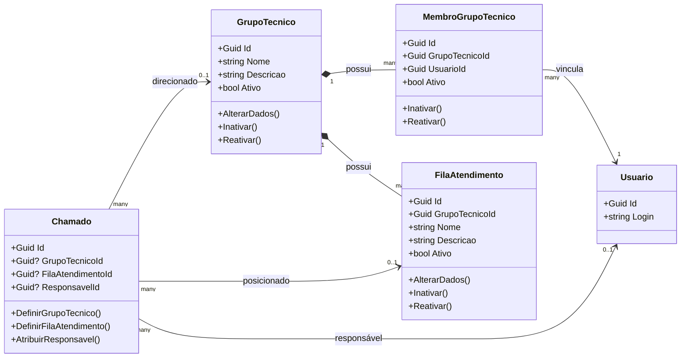

# Sprint 3 - Modelo de Grupo Técnico, Filas e Atribuição

Este documento consolida as especificações técnicas, decisões arquiteturais, regras operacionais e estruturas de banco de dados implementadas na Sprint 3 para a introdução dos conceitos de **Grupos Técnicos**, **Filas de Atendimento** e **Atribuição/Transferência** de chamados no SGX Sistema de Chamados.

---

## 1. Visão Geral

O objetivo principal da Sprint 3 foi introduzir o suporte a equipes ou grupos técnicos de atendimento e segmentação operacional em filas. Isso permite organizar e rotear o atendimento de forma corporativa e profissional (aderente a práticas ITSM/ITIL), sem quebrar a compatibilidade com o fluxo legado de responsável técnico individual.

### Diferenças Conceituais

*   **Grupo Técnico**: Representa a unidade organizacional responsável pelo atendimento (ex: Service Desk, Suporte Técnico, Infraestrutura, Sistemas). É uma equipe composta por múltiplos usuários/membros.
*   **Fila de Atendimento**: Representa uma segmentação operacional de trabalho dentro de um Grupo Técnico. Funciona como uma caixa de entrada ou status interno da fila do grupo, onde os chamados aguardam ação.
*   **Responsável Individual**: O técnico específico (usuário) encarregado da resolução do chamado. Pode ser nulo se o chamado estiver apenas posicionado no grupo/fila, aguardando um técnico assumi-lo.

---

## 2. Modelo de Domínio

O domínio foi enriquecido com três novas entidades e modificações na entidade de chamado existente, preservando a coesão das camadas e a isolação de infraestrutura.



### Entidades do Domínio

1.  **`GrupoTecnico`** ([GrupoTecnico.cs](file:///c:/Pessoal/SGX/SGX%20Sistema%20de%20Chamados%20Completo/src/SGX.SistemaChamado.Domain/Entities/GrupoTecnico.cs))
    *   Entidade independente herdada de `AuditableEntity`.
    *   Métodos de domínio: `AlterarDados(nome, descricao, usuario)`, `Inativar(usuario)` e `Reativar(usuario)`.
2.  **`MembroGrupoTecnico`** ([MembroGrupoTecnico.cs](file:///c:/Pessoal/SGX/SGX%20Sistema%20de%20Chamados%20Completo/src/SGX.SistemaChamado.Domain/Entities/MembroGrupoTecnico.cs))
    *   Entidade que resolve a relação M:N entre `GrupoTecnico` e `Usuario`.
    *   Métodos de domínio: `Inativar(usuario)` e `Reativar(usuario)`.
3.  **`FilaAtendimento`** ([FilaAtendimento.cs](file:///c:/Pessoal/SGX/SGX%20Sistema%20de%20Chamados%20Completo/src/SGX.SistemaChamado.Domain/Entities/FilaAtendimento.cs))
    *   Entidade vinculada a um grupo técnico (`GrupoTecnicoId`).
    *   Métodos de domínio: `AlterarDados(nome, descricao, usuario)`, `Inativar(usuario)` e `Reativar(usuario)`.
4.  **`Chamado`** ([Chamado.cs](file:///c:/Pessoal/SGX/SGX%20Sistema%20de%20Chamados%20Completo/src/SGX.SistemaChamado.Domain/Entities/Chamado.cs))
    *   Propriedades adicionadas: `GrupoTecnicoId` (nullable `Guid`) e `FilaAtendimentoId` (nullable `Guid`).
    *   Navegações correspondentes: `GrupoTecnico` e `FilaAtendimento`.
    *   Métodos de domínio: `DefinirGrupoTecnico(grupoId, usuario)` e `DefinirFilaAtendimento(filaId, usuario)`.
5.  **`Usuario`** ([Usuario.cs](file:///c:/Pessoal/SGX/SGX%20Sistema%20de%20Chamados%20Completo/src/SGX.SistemaChamado.Domain/Entities/Usuario.cs))
    *   Entidade existente que se relaciona indiretamente com grupos via `MembroGrupoTecnico`.

---

## 3. Modelo Relacional

A persistência do modelo relacional foi implementada no PostgreSQL através do EF Core Migrations, respeitando as boas práticas e garantindo índices de desempenho adequados.

### Tabelas e Estruturas

```
┌──────────────────────────────────────────────────────────────────────────────────┐
│                                   grupos_tecnicos                                │
├──────────────────────────────────────────────────────────────────────────────────┤
│ id (UUID, PK)  │ nome (varchar, Unique) │ descricao (varchar) │ ativo (boolean)  │
└──────────────────────────────────────────────────────────────────────────────────┘
                                 │                 │
            ┌────────────────────┘                 └────────────────────┐
            ▼                                                           ▼
┌──────────────────────────────────────────┐               ┌───────────────────────┐
│         membros_grupos_tecnicos          │               │   filas_atendimento   │
├──────────────────────────────────────────┤               ├───────────────────────┤
│ id (UUID, PK)                            │               │ id (UUID, PK)         │
│ grupo_tecnico_id (UUID, FK, Restrict) ───┼─┐             │ grupo_tecnico_id ─────┼─┐
│ usuario_id (UUID, FK, Restrict)          │ │             │ nome (varchar)        │ │
│ ativo (boolean)                          │ │             │ descricao (varchar)   │ │
└──────────────────────────────────────────┘ │             │ ativo (boolean)       │ │
                                             │             └───────────────────────┘ │
                                             │                                       │
                      ┌──────────────────────┘                                       │
                      ▼                                                              ▼
┌────────────────────────────────────────────────────────────────────────────────────┐
│                                      chamados                                      │
├────────────────────────────────────────────────────────────────────────────────────┤
│ id (UUID, PK)                                                                      │
│ grupo_tecnico_id (UUID, FK, Nullable, Restrict) <──────────────────────────────────┘
│ fila_atendimento_id (UUID, FK, Nullable, Restrict) <───────────────────────────────┘
│ responsavel_id (UUID, FK, Nullable)                                                │
└────────────────────────────────────────────────────────────────────────────────────┘
```

1.  **Tabela `grupos_tecnicos`**
    *   Colunas principais: `id` (PK), `nome`, `descricao`, `ativo`, mais colunas de auditoria (`criado_em`, `criado_por`, `atualizado_em`, `atualizado_por`).
    *   Índices:
        *   `ux_grupos_tecnicos_nome` (Unique no campo `nome`).
        *   `ix_grupos_tecnicos_ativo` (Simples no campo `ativo`).
2.  **Tabela `membros_grupos_tecnicos`**
    *   Colunas principais: `id` (PK), `grupo_tecnico_id` (FK para `grupos_tecnicos`), `usuario_id` (FK para `usuarios`), `ativo` + auditoria.
    *   Índices:
        *   `ux_membros_grupos_tecnicos_grupo_usuario` (Unique composto: `grupo_tecnico_id` + `usuario_id`).
        *   `ix_membros_grupos_tecnicos_grupo_tecnico_id` e `ix_membros_grupos_tecnicos_usuario_id`.
3.  **Tabela `filas_atendimento`**
    *   Colunas principais: `id` (PK), `grupo_tecnico_id` (FK para `grupos_tecnicos`), `nome`, `descricao`, `ativo` + auditoria.
    *   Índices:
        *   `ux_filas_atendimento_grupo_nome` (Unique composto: `grupo_tecnico_id` + `nome`).
        *   `ix_filas_atendimento_grupo_tecnico_id`.
4.  **Colunas adicionais em `chamados`**
    *   `grupo_tecnico_id` (FK Nullable para `grupos_tecnicos` com delete restrito).
    *   `fila_atendimento_id` (FK Nullable para `filas_atendimento` com delete restrito).
    *   Índices criados: `ix_chamados_grupo_tecnico_id` e `ix_chamados_fila_atendimento_id`.

### Seeds Iniciais
Configurados no [SeedData.cs](file:///c:/Pessoal/SGX/SGX%20Sistema%20de%20Chamados%20Completo/src/SGX.SistemaChamado.Infrastructure/Persistence/Seed/SeedData.cs):
*   **Grupos**: Service Desk, Suporte Técnico, Infraestrutura, Sistemas.
*   **Filas**: Uma fila padrão associada a cada grupo com o prefixo "Fila" (ex: Fila Service Desk vinculada ao Service Desk).

### Compatibilidade com Chamados Existentes
As novas colunas na tabela `chamados` são criadas como **Nullable** e não há script de backfill automático nas migrations. Isso assegura que chamados antigos funcionem perfeitamente sem grupo ou fila definidos.

---

## 4. Conceitos Operacionais

A implantação destas estruturas modifica a dinâmica de atendimento, introduzindo novos fluxos e estados:

1.  **Fila Implícita (Legado)**: Antes, um chamado era considerado "em fila de atendimento" simplesmente quando `ResponsavelId == null`. O fluxo atual preserva essa possibilidade para cenários legados.
2.  **Fila Explícita (Novo Modelo)**: Agora, um chamado pode ser explicitamente direcionado para um **Grupo Técnico** e posicionado em uma **Fila de Atendimento**, mesmo que ainda esteja sem responsável individual (`ResponsavelId == null`).
3.  **Assunção de Chamado**: O técnico membro ativo do grupo visualiza o chamado na fila do grupo e decide "assumi-lo", o que preenche o `ResponsavelId` sem remover a amarração corporativa de grupo e fila.

---

## 5. Regras de Direcionamento

O direcionamento representa a alocação inicial de um chamado para um determinado Grupo Técnico.

*   **Uso**: Deve ser usado quando o chamado é aberto ou classificado inicialmente, definindo qual grupo corporativo cuidará do atendimento.
*   **Chamados sem grupo**: Chamados antigos ou aberturas sem roteamento mantêm o grupo como `null`.
*   **Chamado no mesmo grupo**: Direcionar para o mesmo grupo é tratado de forma transparente ou apenas move a fila (se informada).
*   **Rejeição cruzada**: Se o chamado já está direcionado a outro grupo técnico, a ação de direcionamento é **rejeitada**. Para mover entre grupos, deve-se usar explicitamente o endpoint de transferência.
*   **Validação da Fila**: Se uma fila for fornecida na requisição, o backend valida se a fila existe, se está ativa e se pertence ao grupo técnico de destino.

---

## 6. Regras de Transferência

A transferência move o chamado que já está alocado sob a guarda de um grupo técnico para outro grupo de atendimento.

*   **Uso**: Quando um grupo detecta que a resolução cabe a outra equipe (escalonamento lateral ou vertical).
*   **Exigência de grupo anterior**: A transferência **exige** que o chamado já possua um grupo técnico definido. Chamados sem grupo (legados ou recém-criados sem grupo) não podem ser transferidos (devem ser direcionados).
*   **Grupo destino ativo**: O grupo de destino precisa existir e estar marcado como ativo.
*   **Limpeza de responsável**: A transferência limpa o `ResponsavelId` (seta para `null`). O chamado volta ao estado "sem responsável individual" no grupo técnico de destino.
*   **Limpeza/redefinição de fila**: A fila anterior do chamado é limpa. Se uma fila válida do grupo destino for informada no request, ela é aplicada; caso contrário, o chamado fica apenas sob a guarda do grupo, sem fila específica.

---

## 7. Regras de Assumir Fila

Esta operação permite que um atendente tire o chamado da fila do seu grupo técnico e o traga para sua carga pessoal de trabalho.

*   **Exigência de grupo e fila**: O chamado precisa ter `GrupoTecnicoId` e `FilaAtendimentoId` definidos.
*   **Status de Ativação**: O grupo técnico e a fila do chamado devem estar ativos.
*   **Usuário autenticado**: O `UsuarioId` informado deve bater exatamente com o do usuário logado na requisição (não é permitido "assumir" para terceiros por este fluxo).
*   **Membro ativo**: O atendente logado deve possuir um vínculo ativo (`MembroGrupoTecnico.Ativo == true`) com o grupo técnico associado ao chamado.
*   **Efeito em `ResponsavelId`**: O campo `ResponsavelId` é preenchido com o ID do atendente.
*   **Preservação**: O grupo técnico e a fila de atendimento originais do chamado são preservados intactos.
*   **Bloqueio de sobreposição**: Se o chamado já possuir responsável individual atribuído, a ação é rejeitada.

---

## 8. Regras de Atribuição Técnica

A atribuição técnica ocorre quando um operador (ex: Administrador ou coordenador) designa um técnico específico para resolver o chamado.

*   **Atribuição Legada (Sem Grupo)**: Se o chamado não possuir grupo técnico, qualquer atendente do sistema pode ser atribuído como responsável.
*   **Atribuição com Grupo**: Se o chamado já estiver associado a um grupo técnico, o técnico designado deve obrigatoriamente ser um **membro ativo** daquele grupo técnico.
*   **Preservação de contexto**: A atribuição altera o `ResponsavelId`, mas preserva o `GrupoTecnicoId` e o `FilaAtendimentoId` atuais do chamado.
*   **Reatribuição**: Se o chamado já possuía responsável anterior, o histórico registra a troca mostrando o técnico de origem e o de destino.

---

## 9. Matriz de Comportamento de `ResponsavelId`

A tabela abaixo sumariza o impacto de cada transação de grupo/fila sobre o responsável individual (`ResponsavelId`):

| Operação | Estado de Origem | Estado de Destino | Comportamento do `ResponsavelId` |
| :--- | :--- | :--- | :--- |
| **Direcionar Chamado** | Sem grupo | Com grupo e fila (opcional) | **Preserva** o responsável atual (se houver) |
| **Assumir Chamado da Fila**| Com grupo/fila e sem técnico | Com grupo/fila e com técnico | **Preenche** com o usuário autenticado |
| **Atribuir Técnico** | Qualquer estado | Técnico definido no grupo | **Altera** para o técnico selecionado (valida membro ativo) |
| **Transferir Grupo** | Com grupo técnico A | Com grupo técnico B | **Limpa** o responsável anterior (torna-se `null`) |
| **Listagens/Ajuste de Grupo**| Qualquer estado | Qualquer estado | **Não altera** o responsável |

---

## 10. Auditoria e Linha do Tempo

A auditoria de movimentações foi integrada ao mecanismo unificado de `HistoricoChamado`, sem criar tabelas paralelas.

### Tipos de Histórico de Chamado
Os seguintes valores do enum `TipoHistoricoChamado` são gerados conforme as movimentações:

*   `GrupoTecnicoDefinido`: Registrado na primeira definição de grupo técnico (direcionamento).
*   `GrupoTecnicoTransferido`: Registrado na troca de grupo técnico (transferência).
*   `FilaAtendimentoDefinida`: Registrado ao associar o chamado a uma fila pela primeira vez.
*   `FilaAtendimentoRemovida`: Registrado na remoção da fila de atendimento.
*   `FilaAtendimentoTransferida`: Registrado na movimentação direta de fila dentro do mesmo grupo ou na transferência.
*   `ResponsavelRemovidoPorTransferenciaGrupo`: Registrado quando o responsável anterior é limpo devido à mudança de grupo técnico.
*   `ChamadoAssumidoDaFila`: Registrado quando um atendente assume o chamado diretamente de uma fila operacional.
*   `ResponsavelAlterado`: Registrado na atribuição ou reatribuição manual de técnico específico.

### Detalhes Técnicos e Limitações
*   **Auditoria Textual**: Os históricos não armazenam chaves relacionais específicas para as entidades de grupo ou fila de origem/destino. As informações de rastreabilidade (ex: "Transferido do grupo Sistemas para o grupo Infraestrutura") são descritas textualmente no campo `Descricao` do histórico.
*   **Integridade do Enum**: Os testes automáticos (`AuditoriaModulosCriticosTests.cs`) asseguram que a ordem e os valores inteiros do enum `TipoHistoricoChamado` não sofram quebras, garantindo que o histórico antigo do banco continue legível e correto.

---

## 11. Permissões e Segurança

O SGX adota uma política de autorização de duas camadas (API baseada em policies e camada de aplicação baseada no perfil e status do usuário).

### Matriz de Acesso das Operações

| Operação | Requisito Backend (Use Cases) | Política HTTP (Controllers) | Restrições Específicas |
| :--- | :--- | :--- | :--- |
| **Criar/Editar Grupo** | Perfil Administrador | `Policies.Administrador` | Bloqueia se o nome for vazio ou duplicado. |
| **Mudar Status Grupo** | Perfil Administrador | `Policies.Administrador` | Impede inativação de grupos com vínculos. |
| **Listar/Obter Grupos**| Perfil Admin ou Atendente | `Policies.AdminOuAtendente` | Aberto para operação técnica. |
| **Gerenciar Membros** | Perfil Administrador | `Policies.Administrador` | Valida existência do usuário e do grupo. |
| **Direcionar Chamado** | Perfil Admin ou Atendente | `Policies.AdminOuAtendente` | Rejeita chamado que já pertence a outro grupo. |
| **Transferir Chamado**  | Perfil Admin ou Atendente | `Policies.AdminOuAtendente` | Rejeita chamado sem grupo de origem definido. |
| **Assumir Fila** | Perfil Admin ou Atendente | `Policies.AdminOuAtendente` | Usuário logado deve ser membro ativo do grupo. |
| **Atribuir Técnico** | Perfil Administrador | `Policies.Administrador` (Sprint 3) | Técnico destino deve ser membro ativo do grupo. |
| **Listagem de Chamados**| Perfil Admin ou Atendente | `Policies.AdminOuAtendente` | Permite filtragem por grupo e fila. |

### Validação de UI vs Backend
*   **Frontend**: As telas ocultam elementos de ação (como o botão de transferir ou gerenciar membros) com base nas claims do token JWT.
*   **Backend**: Toda a validação operacional e de permissão é reexecutada na camada de aplicação (Use Cases), servindo como barreira de segurança definitiva contra requisições forjadas.

---

## 12. APIs Criadas e Alteradas

Os seguintes endpoints administrativos foram expostos e protegidos no controller [AdminGruposTecnicosController.cs](file:///c:/Pessoal/SGX/SGX%20Sistema%20de%20Chamados%20Completo/src/SGX.SistemaChamado.Api/Controllers/AdminGruposTecnicosController.cs) e no [AdminChamadosController.cs](file:///c:/Pessoal/SGX/SGX%20Sistema%20de%20Chamados%20Completo/src/SGX.SistemaChamado.Api/Controllers/AdminChamadosController.cs):

### Endpoints de Grupo Técnico e Fila
*   `GET /api/admin/grupos-tecnicos`: Lista todos os grupos técnicos cadastrados (permite filtrar por status).
*   `GET /api/admin/grupos-tecnicos/{id}`: Detalha um grupo técnico.
*   `POST /api/admin/grupos-tecnicos`: Cadastra um novo grupo técnico (Restrito a Admin).
*   `PUT /api/admin/grupos-tecnicos/{id}`: Atualiza os dados cadastrais do grupo técnico (Restrito a Admin).
*   `PATCH /api/admin/grupos-tecnicos/{id}/status`: Ativa ou inativa logicamente um grupo técnico (Restrito a Admin).
*   `GET /api/admin/grupos-tecnicos/{grupoTecnicoId}/filas`: Retorna a listagem de filas vinculadas ao grupo técnico informado.

### Endpoints de Membros do Grupo
*   `GET /api/admin/grupos-tecnicos/{grupoTecnicoId}/membros`: Lista os membros de um determinado grupo técnico.
*   `POST /api/admin/grupos-tecnicos/{grupoTecnicoId}/membros`: Insere um novo usuário como membro do grupo técnico (Restrito a Admin).
*   `PATCH /api/admin/grupos-tecnicos/{grupoTecnicoId}/membros/{membroId}/status`: Ativa ou inativa o vínculo de um membro no grupo (Restrito a Admin).
*   `GET /api/admin/usuarios/{usuarioId}/grupos-tecnicos`: Retorna todos os grupos técnicos aos quais um usuário específico está vinculado.

### Endpoints de Operações do Chamado
*   `POST /api/admin/chamados/{id}/direcionar-grupo`: Direciona o chamado para um grupo técnico e fila (opcional).
*   `POST /api/admin/chamados/{id}/transferir-grupo`: Transfere o chamado de seu grupo técnico atual para outro grupo de destino e fila (opcional).
*   `POST /api/admin/chamados/{id}/assumir-fila`: Associa o atendente logado como responsável individual do chamado da fila.

---

## 13. Frontend Criado e Alterado

As telas do portal administrativo foram construídas e evoluídas utilizando Quasar Framework e Vue 3 na pasta `src/SGX.SistemaChamado.Web`.

1.  **Tela de Cadastro e Listagem de Grupos Técnicos** (`GruposTecnicosAdminView.vue`)
    *   Exibe tabela com os grupos e botão para cadastro/edição em modal.
2.  **Tela de Gestão de Membros** (`GrupoTecnicoMembrosAdminView.vue`)
    *   Gerenciamento dinâmico de integrantes de cada grupo técnico com pesquisa e toggle de ativo/inativo.
3.  **Tela de Filas por Grupo** (`GrupoTecnicoFilasAdminView.vue`)
    *   Lista as filas cadastradas associadas a cada grupo.
4.  **Ajustes no Detalhe do Chamado** (`AdminDetalheChamadoView.vue`)
    *   Exibe no cabeçalho operacional as tags de **Grupo Técnico** e **Fila**.
    *   Exibe botão **Assumir Chamado** (apenas se o chamado estiver em uma fila e o atendente logado for membro ativo do grupo).
    *   Exibe botão **Transferir Grupo** abrindo janela de seleção de grupo e fila destino.
5.  **Listagem e Filtros de Chamados** (`AdminChamadosView.vue`)
    *   Adicionadas colunas correspondentes de grupo e fila na grid principal.
    *   Filtro avançado por grupo técnico e fila de atendimento.

---

## 14. Testes Executados

Uma bateria rigorosa de testes de integração e unitários cobriu todos os cenários para prevenir regressões:

*   **Cadastro e CRUD de Grupos**: Validação de nomes obrigatórios, duplicados, listagens vazias e ativação/inativação (`GruposTecnicosAdminUseCaseTests.cs`).
*   **Membros de Grupo**: Inserção de membro, ativação e inativação lógica, bloqueio de duplicidade ativa (`MembrosGruposTecnicosAdminUseCaseTests.cs`).
*   **Regras de Direcionamento**: Valida direcionamento inicial, rejeição para chamados com grupo pré-existente e consistência de fila (`DirecionarChamadoGrupoTecnicoAdminUseCaseTests.cs`).
*   **Regras de Assumir Fila**: Garante o preenchimento correto do responsável, validação se o atendente logado realmente pertence ao grupo ativo e integridade do chamado (`AssumirChamadoFilaAdminUseCaseTests.cs`).
*   **Regras de Transferência**: Validação de limpeza de responsável, mudança correta de grupo e fila de destino, e rejeição de chamados sem grupo prévio (`TransferirGrupoTecnicoChamadoUseCaseTests.cs`).
*   **Preservação e Regressão**: Testes que confirmam que o fluxo legado de abertura e atribuição não sofreu quebras, mantendo o `ResponsavelId` opcional e íntegro (`AssumirChamadoUseCaseTests.cs`, `AtribuirChamadoUseCaseTests.cs`).
*   **Auditoria**: Validação de geração de históricos coerentes com descrições ricas detalhando as movimentações (`AuditoriaModulosCriticosTests.cs`).

---

## 15. Decisões Técnicas

Durante o refinamento da Sprint 3, as seguintes decisões arquiteturais foram consolidadas:

*   **Não obrigatoriedade de Grupo/Fila na Abertura**: Manter `GrupoTecnicoId` e `FilaAtendimentoId` opcionais na criação do chamado simplifica a experiência de abertura para o solicitante e mantém o sistema compatível com automações antigas.
*   **Separação entre Grupo e Responsável**: Manter o grupo técnico e o técnico responsável em propriedades separadas no banco permite que chamados fiquem alocados em equipes sem estarem sob a responsabilidade de um único indivíduo.
*   **Sem Auditoria Paralela**: Optou-se por estender o enum `TipoHistoricoChamado` em vez de criar tabelas de histórico separadas para o trâmite de grupos, aproveitando a infraestrutura de linha do tempo existente.
*   **Controller Fino**: Toda a lógica de verificação de claims de permissão e consistência de dados (como verificar se a fila pertence ao grupo destino) reside nos Use Cases, mantendo as controllers limpas e fáceis de testar.
*   **Backend como Fonte da Verdade**: A UI apenas auxilia a navegação, sendo que todas as validações de segurança e negócio ocorrem rigidamente no C#.

---

## 16. Limitações Conhecidas

Fica registrado o escopo que não foi coberto nesta sprint, restando para evoluções futuras:

1.  **CRUD de Filas Incompleto**: Não há telas de cadastro ou edição de filas de atendimento nesta sprint (apenas seeds e listagem). A criação de novas filas requer intervenção via banco ou migrations.
2.  **Rastreabilidade Estruturada da Auditoria**: O histórico de trâmite de grupo/fila não possui FKs de auditoria histórica, apenas a descrição textual do que foi alterado.
3.  **Restrição Visual por Grupo**: Atendentes ainda conseguem visualizar chamados de outros grupos técnicos nas listagens administrativas gerais (a restrição de visualização baseada estritamente nos grupos do usuário não faz parte do escopo atual).
4.  **Arquivos Indevidos (.dotnet-cli-home)**: Alguns arquivos locais de cli-home surgem em builds de contêineres locais. Recomenda-se adicioná-los ao `.gitignore` global e removê-los do versionamento.

---

## 17. Próximas Evoluções

Recomendamos as seguintes etapas para as próximas Sprints:

*   **Roteamento Automático**: Implementação de um motor de regras para direcionar chamados automaticamente a grupos técnicos específicos com base na categoria ou tipo de solicitação selecionada.
*   **OLA (Agreement de Nível Operacional)**: Configuração de SLAs específicos por grupo técnico (tempo máximo de trâmite em fila ou tempo limite de resolução interna por equipe).
*   **Painel de Filas de Atendimento (Kanban)**: Tela operacional para visualização de chamados posicionados nas respectivas filas de atendimento do grupo.
